# POV Goals for Hire Me Inc.

**Prepared by Luke Hertert - Sales Engineer**

**November 2018**

## Summary

**Hire Me Inc.** is in the process of completely transforming their customer experience.  They are adopting
new technologies like containers, modernizing their architecture by breaking their monolith architecture into
microservices, and are moving their applications to the cloud.  

While these changes have enabled **Hire Me Inc.** to deliver a superior customer experience and react to market
needs faster than ever before, they have also brought a new set of challenges. **Hire Me Inc.** has engaged Datadog
to help enable this transformation while reducing the risks of moving quickly.

## What does Hire Me Inc. want to achieve?

### Goal: Improved environment visibility

**Challenges of the Current State**

* Current monitoring solutions provide no visibility into Docker environments
* With the adoption of microservices, it is very difficult to troubleshoot slow performing applications
* Issues are discovered when customers complain because current static threshold based alerting is ineffective
* No integration with cloud providers with current monitoring tools
* Difficult to track metrics that are critical to the business but are unique to **Hire Me Inc.**

**Benefits of the Future State**

* Infrastructure monitoring for both host and containers for Docker
* Deep diagnostic code visibility for troubleshooting application performance
* Powerful anomaly driven alerting based on historical seasonality
* Instant cloud provider monitoring without installing anything 
* Extensible platform that supports custom metrics

### Goal: Provide a single platform for monitoring and alerting that is simple to deploy and use

**Challenges of the Current State**

* No way to correlate application performance with infrastructure metrics
* Have to look at different tools for logs, infrastructure, and application monitoring
* Impossible to create a single dashboard that shows the health of entire environment
* Difficult to install and configure monitoring agents
* Current monitoring tools do not allow for API based automation

**Benefits of the Future State**

* Easily build dashboards that show both infrastructure and application health
* A single intuitive, easy to use UI that includes data from entire ecosystem including logs and metrics
* Powerful dashboarding capabilities that can display data from multiple sources
* Simple installation of a single agent
* Robust API for automation of tasks such as creation of dashboards

# POV Recap

Getting started/Collecting Metrics/Visualizing data
---------------------------------------------------

The first goal of the POV was to show how easy it is to set up a new account, install our first integration, and
start reporting data.  We decided to target a representative container for the **Hire Me Inc.** environment: a docker container 
and a MySQL server.  In under an hour, we had a brand new account and had deep container metrics reporting as well as an out of the
box dashboard for our database server.

### Steps Taken

1) Forked repo to [ldhddint/hiring-engineers](https://github.com/ldhddint/hiring-engineers)

2) Created [Dockerfile](apm/Dockerfile) based on public Docker image `datadog/docker-dd-agent`

3) Created new Datadog account (luke.hertert+interview@datadog.com)

    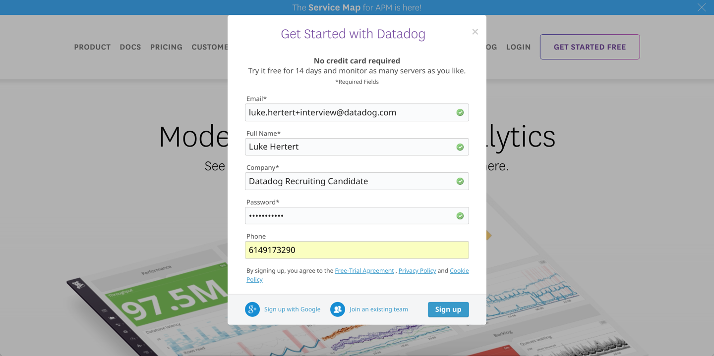

4) Selected Docker/Github for my stack (there isn't much of one yet)
    
    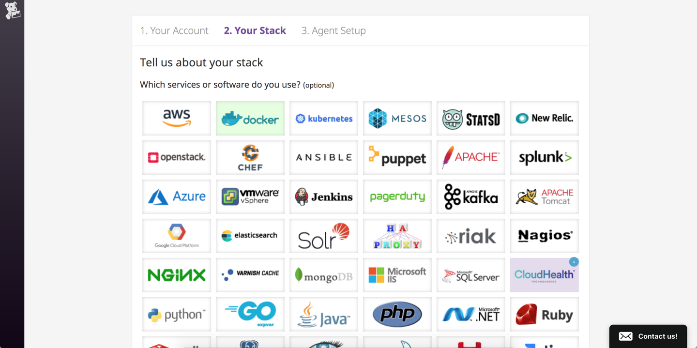

5) Use docker run command for quickstart (1 minute)

    `docker run -d --name dd-agent -v /var/run/docker.sock:/var/run/docker.sock:ro -v /proc/:/host/proc/:ro -v /sys/fs/cgroup/:/host/sys/fs/cgroup:ro -e DD_API_KEY=8f6efa9b847082c3b3bfff932d1309b4 datadog/agent:latest`

6) First agent is reporting! 

    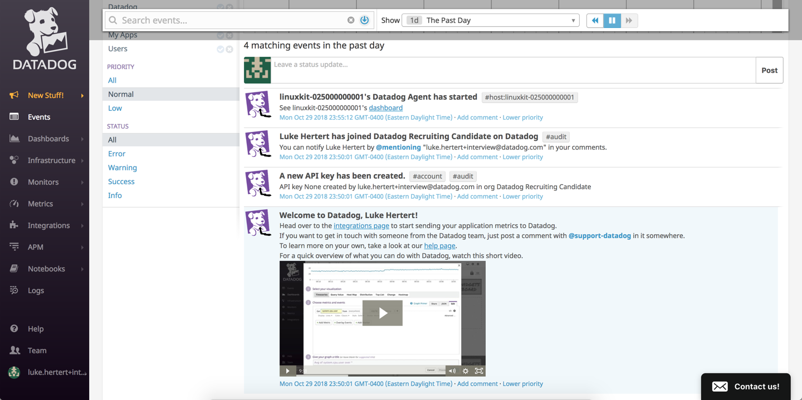

7) Added tags, confirmed presence in Host Map

    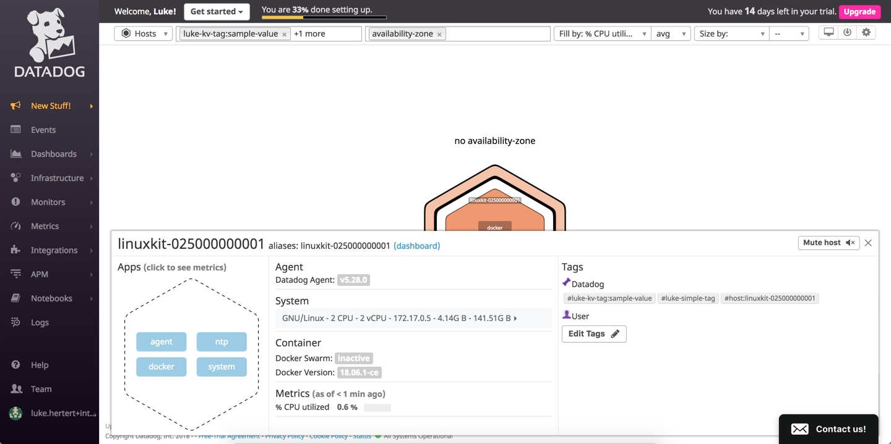

8) Enabled mysql integration via https://app.datadoghq.com/account/settings#integrations/mysql

9) Created [docker-compose.yml](docker-compose.yml) that includes datadog agent dockerfile as well as a mysql container.  Added [mysql.yml](mysql.yaml) to `/etc/dd-agent/conf.d/mysql.yaml`.  I was not seeing the expected results, so I attached a shell to the datadog agent container and ran `service datadog-agent info`.  I saw the following relevant output:

    ```
    mysql (1.4.0)
        -------------
        - instance #0 [WARNING]
            Warning: Privilege error or engine unavailable accessing the INNODB status                          tables (must grant PROCESS): (1227, u'Access denied;you need (at least one of) the PROCESS privilege(s) for this operation')
        - Collected 58 metrics, 0 events & 1 service check
        - Dependencies:
            - pymysql: 0.8.0
    ```

    In a real world scenario, I would grant the documented persmissions to the database user, however for the purposes of this example, I configured the datadog collector to connect using the root credentials.  This resolved the warnings in the info output.

    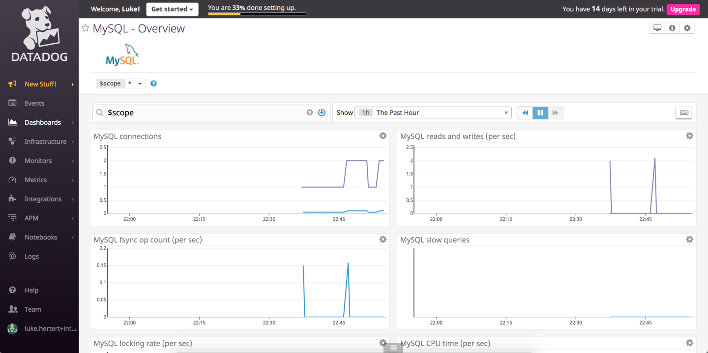

Custom Metric
-------------

Next, we wanted to track a metric that is critical to **Hire Me Inc.**'s business but that there is no out of the box integration for.
This was easy to accomplish by creating a custom monitor, and we can now visualize and alert on this metric.

Steps: Create the following files in the datadog agent container:

**/etc/dd-agent/conf.d/hello.yaml**

```yaml
init_config:

instances:
[{}]
```

**/etc/dd-agent/checks.d/hello.py**
```python
from checks import AgentCheck
import random

class HelloCheck(AgentCheck):
    def check(self, instance):
        self.gauge('my_metric', random.randint(0,1001))
```

Goal: Change collection interval (without changing python file)

Change `hello.yaml` to the following:

```yaml
init_config:

instances:
    - min_collection_interval: 45
```

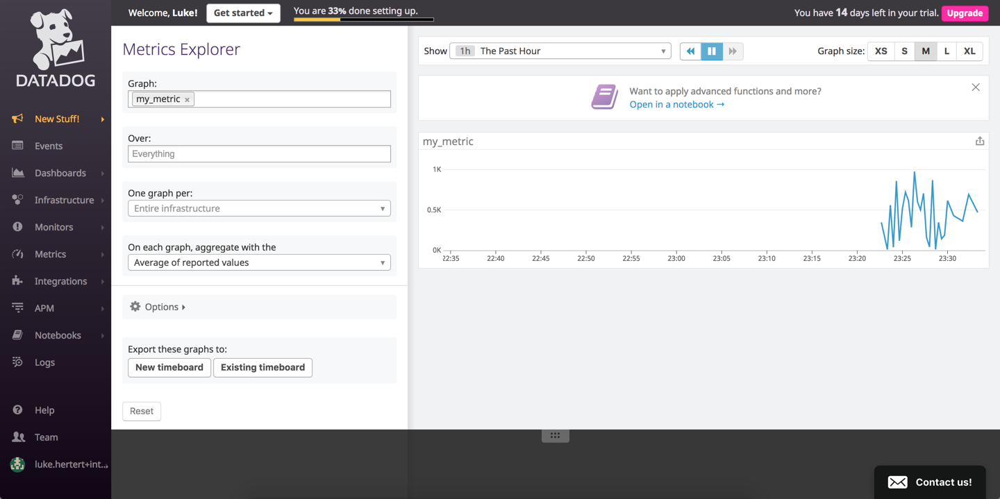

Visualizing Data
----------------

**Hire Me Inc.** has gone to great lengths to automate everything.  They are leveraging infrastructure as code, and are doing
continuous delivery via various DevOps toolsets.  It is important to them that their monitoring platform provides robust APIs for 
it to enable their automation efforts.  To this end, we decided to write a script that allows them to publish a custom dashboard
purely via the Datadog API.

Steps:

1) Created a new Application key

    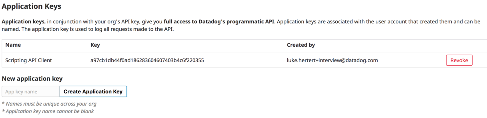

2) Created a timeboard via the UI that satisfied specified requirements  

3) Get dashboard definition JSON via API by making GET request to `https://api.datadoghq.com/api/v1/dash/966070?api_key=8f6efa9b847082c3b3bfff932d1309b4&application_key=a97cb1db44f0ad186283604607403b4c6f220355`

4) Create dashboard via [script](timeboard/createTimeboard.sh)

    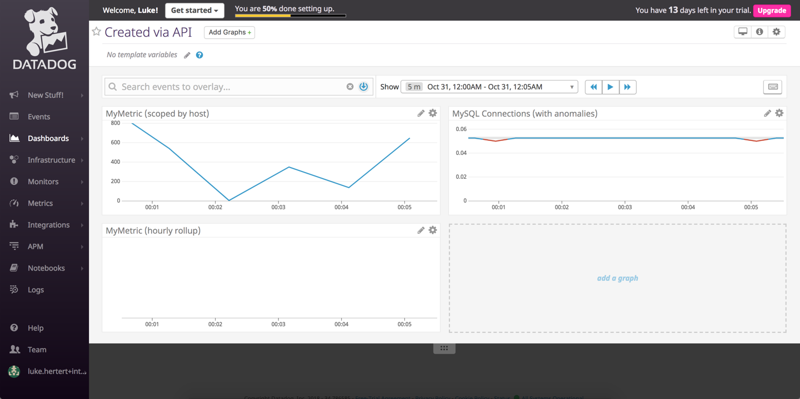

    **Take a snapshot of this graph and use the @ notation to send it to yourself.**

    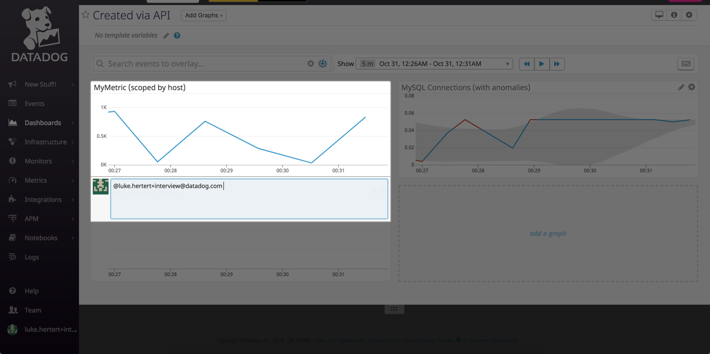

    **Bonus Question: What is the Anomaly graph displaying?**

    The anomoly function will display a band that indicates expected values based on historical data, including factors such as seasonality.  One of the parameters allows you to select from multiple different baselining algorithms. Side note - the 2 minute overview video of this feature was super informative and well done.  It helped me gain a basic understanding of the differences between the Datadog implementation and the AppD dynamic baselining.


Monitors
--------

In order to address **Hire Me Inc.**'s current issues with alerting, we showed how easy it is to create email alerts on custom 
metrics that contain the data that is relevant to the incident.  We quickly set up a custom monitor, with conditions that they
defined, and an notification template.  We also created maintainance windows so that they are not notified during their 
off-peak horus.

**Detection method/metric/conditions**

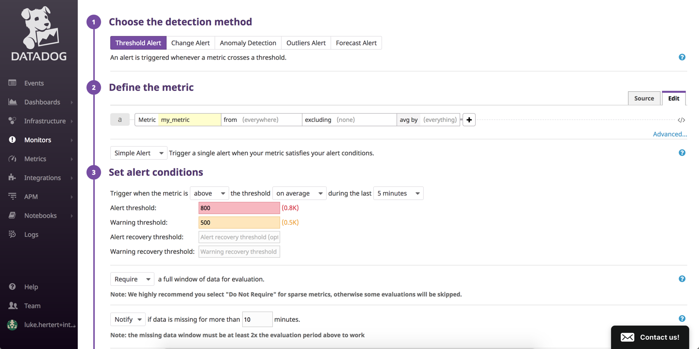

Email template
```
{{#is_alert}}
    my_metric value {{value}} is above 800 for IP address {{host.ip}}!
{{/is_alert}}

{{#is_warning}}
    my_metric is above 500!
{{/is_warning}}

{{#is_no_data}}
    my_metric has had no data for 10 minutes!
{{/is_no_data}} @luke.hertert+interview@datadog.com
```

**Note - When I signed up I put in an invalid email address, so I didn't actually get email notificatoins.  Below are screenshots of the triggered events inside the datadog UI**

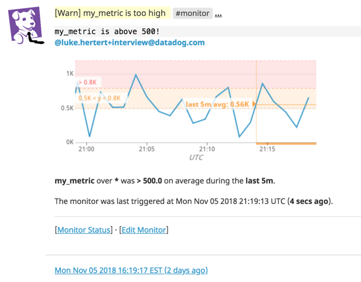

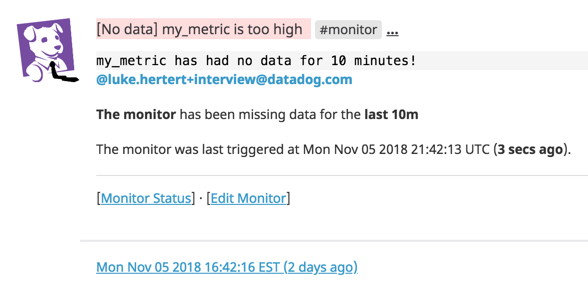

**Bonus Question: Since this monitor is going to alert pretty often, you don’t want to be alerted when you are out of the office. Set up two scheduled downtimes for this monitor**

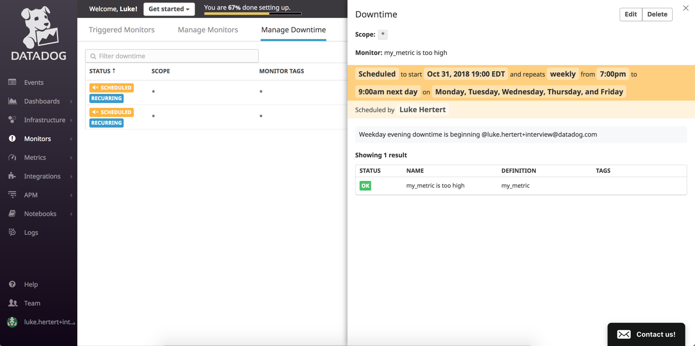


APM
---

One of the biggest areas that lacked visibility for **Hire Me Inc.** was the application performance of their microservices.  
With just two lines of code, we were able to get deep diagnostic visibility into their custom Flask application.

1) For agent container, set the following environment variables

    ```
    DD_APM_ENABLED: "true"
    NON_LOCAL_TRAFFIC: "true"
    ```

2) Create new docker container with python, flask, and ddtrace installed, and copy sample flask app ([Dockerfile](apm/Dockerfile)).  

3) Configure tracer to point to agent container by adding the following code: 

    ```python
    from ddtrace import tracer
    tracer.configure(hostname='datadog', port=8126)
    ```  

4) Set entry point to `ddtrace-run python app.py`.

5) Apply load to flask endpoints to generate traces

    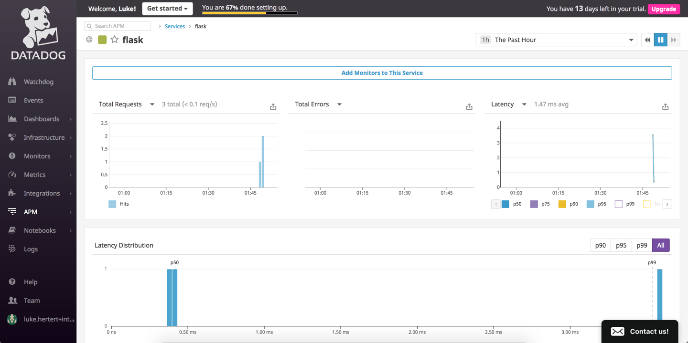

6) Create a dashboard that has both infrastructure and APM metrics

    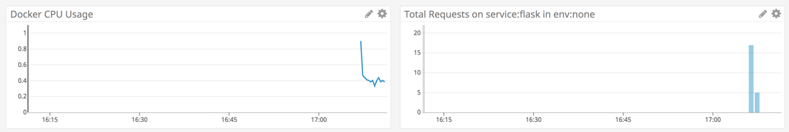

**Bonus Question: What is the difference between a Service and a Resource?**

A service is a monitored application, and a resource is a distinct transaction within an application.

# Final Question

**Hire Me Inc.** has asked us to think a creative way that they could use Datadog.  In our talks with
the Devops team at **Hire Me Inc.**, we have heard complaints that they want to take their CI/CD pipeline to the
next level.  They currently are leveraging Jenkins to build their microservice artifacts, and are publishing their
containers to AWS using AutoScaling groups.  But this is all accomplished using a rolling deployment with
simple up/down health checks.

We suggest that **Hire Me Inc.** leverage the information that Datadog is collecting to create a deployment gate to 
ensure that a canary release has no performance issues prior to advancing the release process.  The proposed process
is as follows:

1) Use jenkins to build artifact and publish new release to AWS
2) Create a new deployment to Autoscaling group that has a limited size
3) Leverage a simple lambda function that watches logs and compares key KPIs (CPU, memory, response times, errors, etc) to historical values to ensure that application is performing normally.  
4) If health check for canary release is acceptable, proceed with full deployment of new release